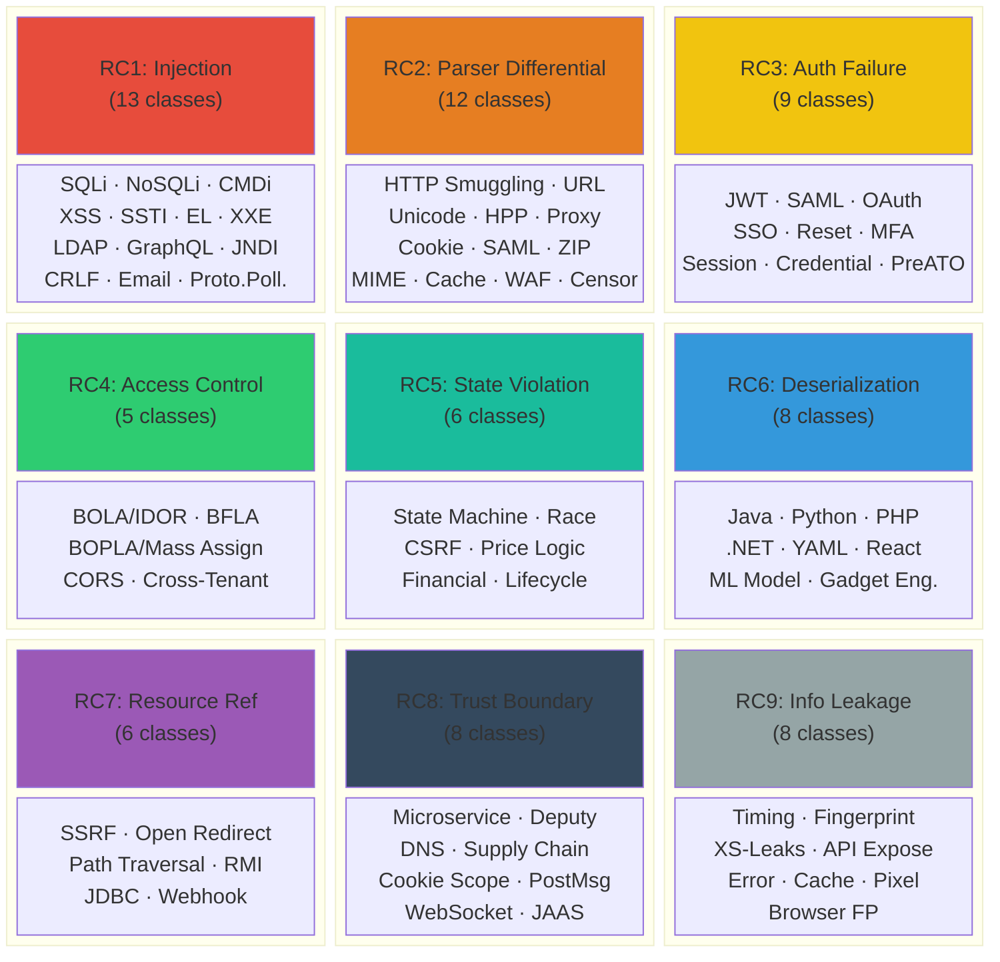
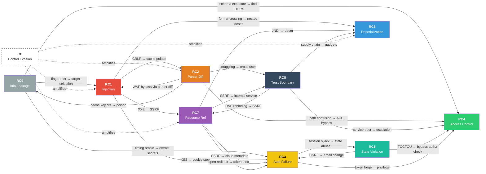
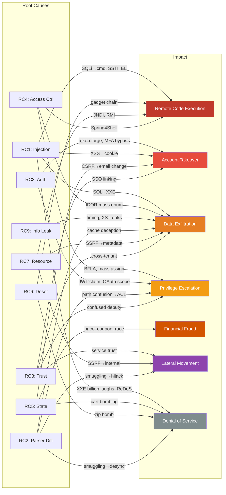
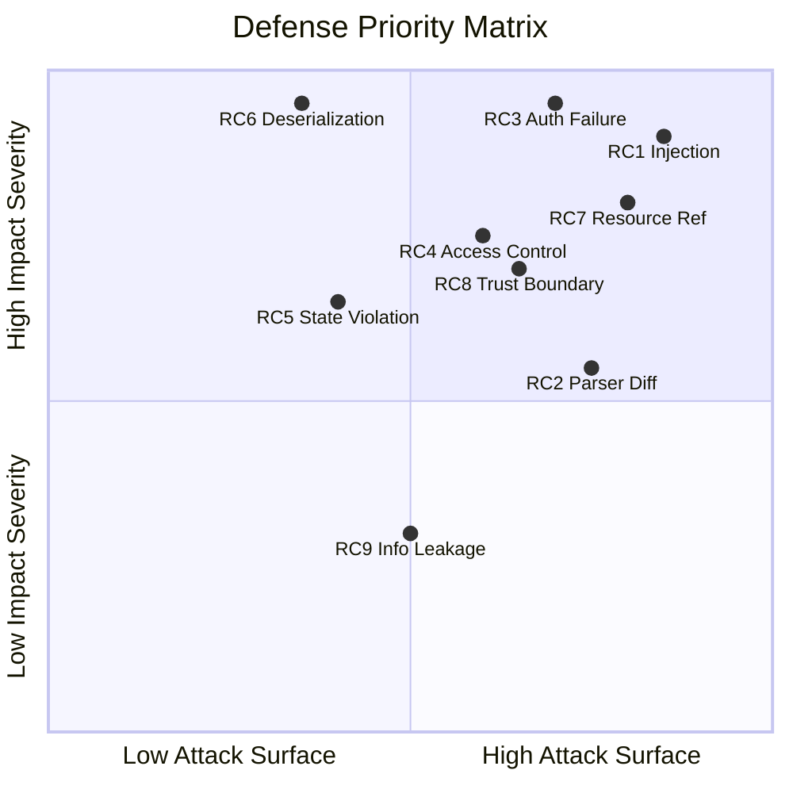
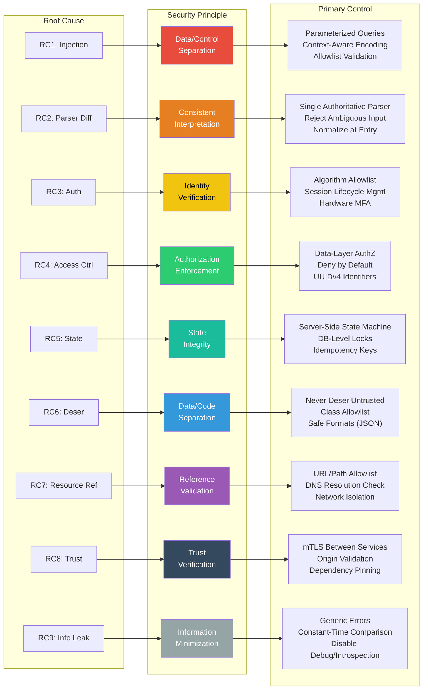

# Root-Cause Taxonomy — Visual Maps

---

## 1. RC Overview: 9 Root Causes & Technique Distribution

---

## 2. Cross-RC Amplification Graph

> Root causes are not independent. One RC enables or amplifies another. This graph reveals the structural reason behind real-world attack chaining.

**Reading this graph**:
- **Solid arrows** = one RC enables or chains into another
- **Dashed arrows** = CC (Security Control Evasion) amplifies the target RC
- **Most connected nodes** = RC1 (Injection), RC7 (Resource Ref), RC3 (Auth) — primary chain pivots
- **Key insight**: RC2 (Parser Diff) and RC7 (Resource Ref) are the strongest "enablers" — hub nodes that activate other RCs. Blocking these two weakens the entire chain graph.

---

## 3. Impact Convergence: Multiple Paths to Same Impact

> Multiple root causes converge on the same impact. Defending by impact is futile — each RC path must be blocked independently at its root cause.

**Key insights**:
- **Data Exfiltration** is reachable from the most RCs (6 paths) — the widest attack surface
- **RCE** is reachable from 4 independent RCs — blocking one path leaves the others intact
- **Financial Fraud** is reachable only from RC5 — securing state integrity alone eliminates this impact class
- **DoS** is reachable from 4 RCs but is generally the lowest-priority impact for most organizations

---

## 4. Common Real-World Attack Chains

> Real-world attacks are not single-RC events — they are RC chains. These are the most frequently observed multi-RC combinations.

```mermaid
graph TD
  subgraph "Chain 1: Classic Web App Compromise"
    A1["RC9: Fingerprinting\n(identify framework)"] --> A2["RC1: Injection\n(SQLi/SSTI found)"]
    A2 --> A3["CC: WAF Bypass\n(encoding mutation)"]
    A3 --> A4["RC1→RCE\n(command execution)"]
  end

  subgraph "Chain 2: API-First ATO"
    B1["RC9: API Schema Exposure\n(Swagger/GraphQL introspection)"] --> B2["RC4: IDOR\n(user data enumeration)"]
    B2 --> B3["RC3: Auth Bypass\n(JWT claim manipulation)"]
    B3 --> B4["Account Takeover"]
  end

  subgraph "Chain 3: Cloud Infrastructure Pivot"
    C1["RC1: XXE/SSRF\n(initial entry)"] --> C2["RC7: SSRF\n(cloud metadata 169.254.169.254)"]
    C2 --> C3["RC3: IAM Credential Theft"]
    C3 --> C4["RC8: Cross-Service Lateral\n(assume-role)"]
  end

  subgraph "Chain 4: Supply Chain → RCE"
    D1["RC8: Dependency Confusion\n(malicious package)"] --> D2["RC6: Deserialization\n(gadget chain activated)"]
    D2 --> D3["Remote Code Execution"]
  end

  subgraph "Chain 5: Parser Diff → Cross-User"
    E1["RC2: HTTP Smuggling\n(CL.TE desync)"] --> E2["RC3: Session Hijack\n(response queue poison)"]
    E2 --> E3["RC4: Privilege Escalation\n(admin session captured)"]
  end

  subgraph "Chain 6: Logic → Financial"
    F1["RC5: Race Condition\n(TOCTOU)"] --> F2["RC5: Double-Spend\n(parallel withdraw)"]
    F2 --> F3["Financial Fraud"]
  end

  style A4 fill:#c0392b,color:#fff
  style B4 fill:#e74c3c,color:#fff
  style C4 fill:#8e44ad,color:#fff
  style D3 fill:#c0392b,color:#fff
  style E3 fill:#f39c12,color:#fff
  style F3 fill:#d35400,color:#fff
```

---

## 5. Defense Priority: Attack Surface × Impact Severity

> Which RCs to defend first? Prioritized by Attack Surface (number of connected RCs and entry points) × Impact Severity (worst-case achievable outcome).

**Reading the quadrant**:
- **Top-Right (defend first)**: RC1 (Injection), RC3 (Auth), RC7 (Resource Ref) — high attack surface + high impact
- **Top-Left (high impact, narrow surface)**: RC6 (Deserialization) — instant RCE when found, but entry points are limited
- **Bottom-Right (wide surface, lower standalone impact)**: RC2 (Parser Diff) — less direct impact, but the strongest enabler for other RCs
- **Bottom-Left (lower priority)**: RC9 (Info Leakage) — low standalone impact, but often the first step in a chain

---

## 6. Root Cause → Security Principle → Defense Control

> Practical blue team mapping: each RC maps to a violated security principle, which maps to concrete defense controls.

---

## Summary: What These Visuals Reveal

| Diagram | Key Insight |
|---|---|
| **#2 Amplification Graph** | RC2 (Parser Diff) and RC7 (Resource Ref) are "hub" nodes — they enable the most other RCs. Blocking these two weakens the entire attack chain graph. |
| **#3 Impact Convergence** | Data Exfiltration is reachable from 6 RCs. Defending by impact class is futile — each RC path must be eliminated at its root cause. |
| **#4 Attack Chains** | Real-world attacks chain 2-4 RCs. Breaking any single link in the chain stops the entire attack. |
| **#5 Defense Priority** | RC1 (Injection) + RC3 (Auth) + RC7 (Resource) sit in the top-right quadrant. These three are the highest-priority defense targets. |
| **#6 RC → Principle → Control** | Implementing 9 security principles eliminates 340+ technique variants at the root cause level. |
